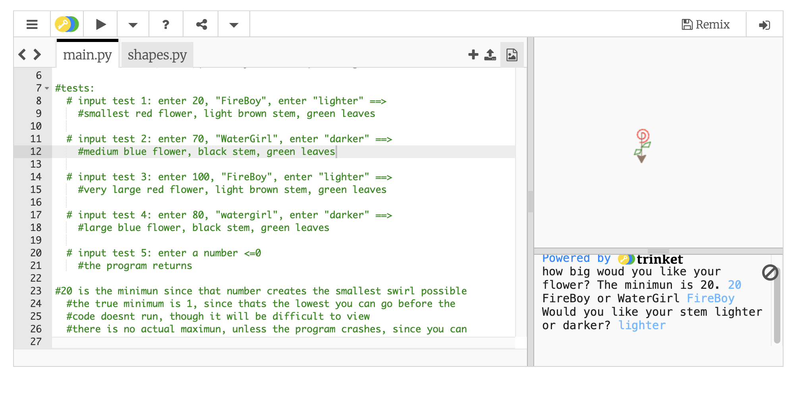
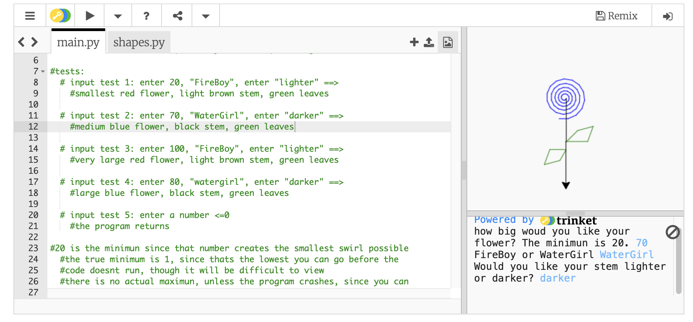
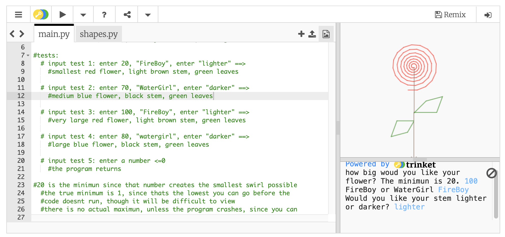
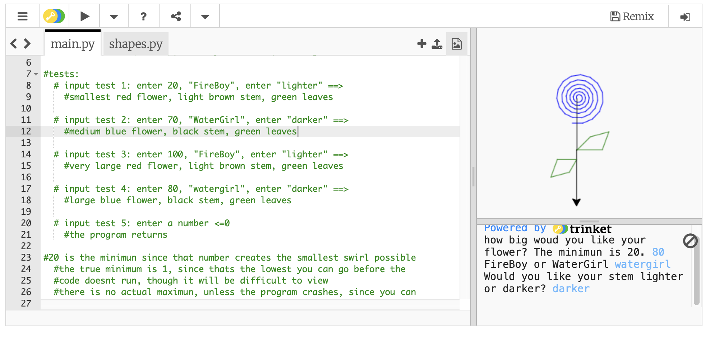
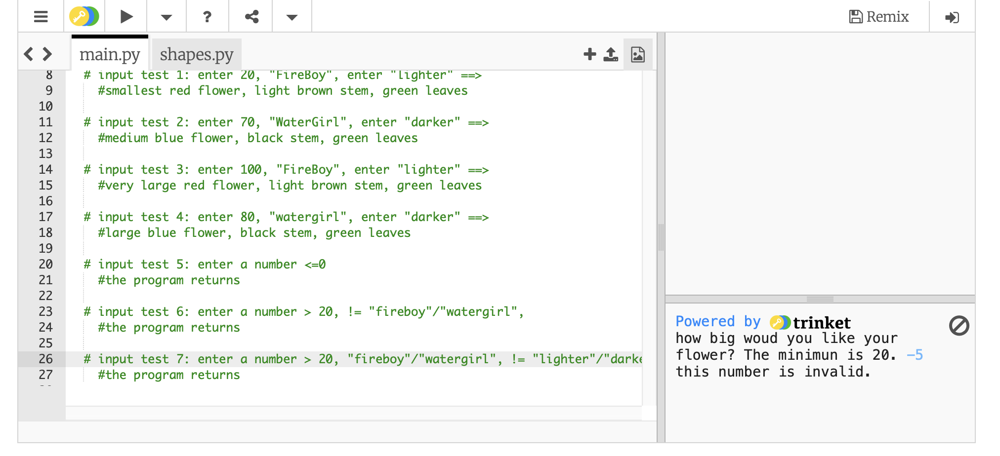
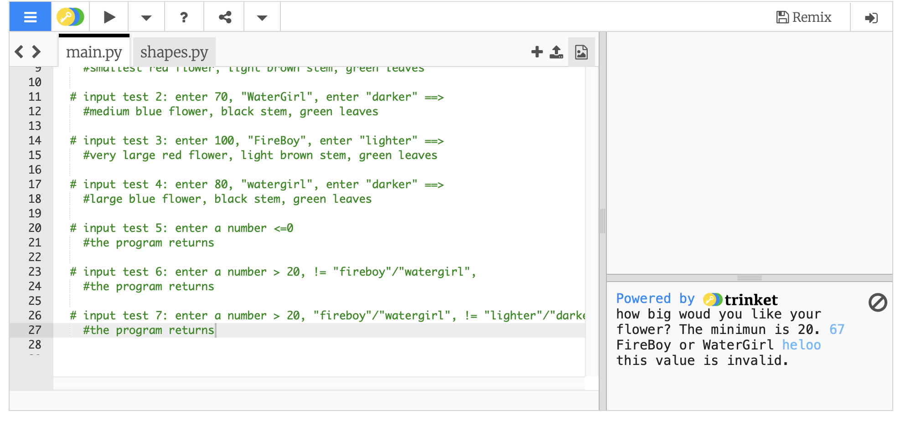
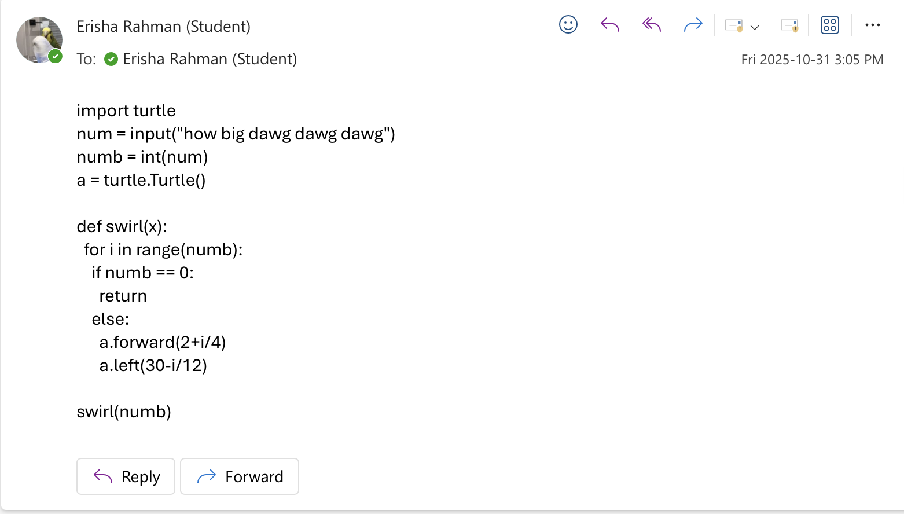
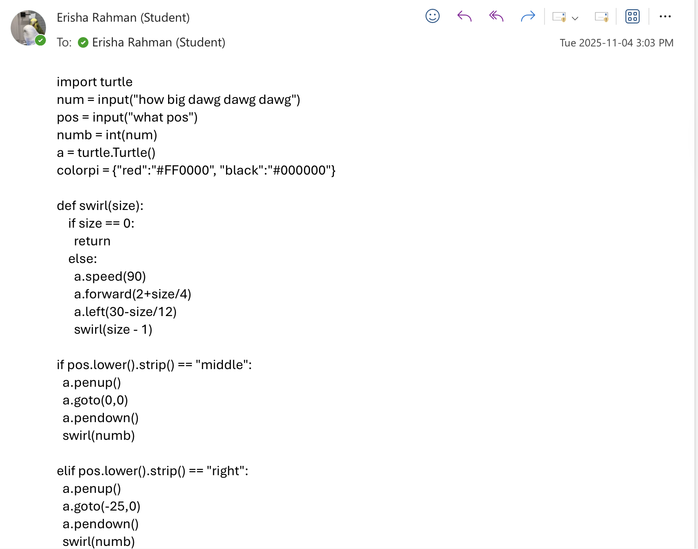
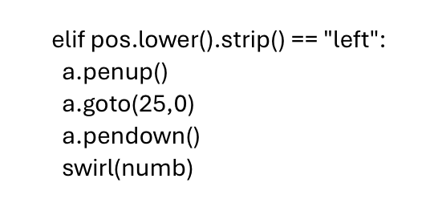

TURTLE RECURSIVE FLOWER PROJECT
⋆°❀⋆.ೃ࿔*:･⋆°❀⋆.ೃ࿔*:･⋆°❀⋆.ೃ࿔*:･⋆°❀⋆.ೃ࿔*:･

instructions!!!
    Once the code is inputed into trinket, enter a size under 150 thats prefferably over 20.
        numbers that are 0 or below will not work.
    Enter "fireboy" or Watergirl" (not case sensitive) for a color. the code will not work other other words
    Enter "lighter" or "darker" for a stem color. the code will not work with other words.
    Once the three inputs are properly added, a flower will be drawn with the specific colors and size chosen

Recursion and depth discussion
    The number of recurssions, [size], would be decreased with every loop, pushing it closer and closer to the base case, since i wanted a normal swirl without any weird patterns occuring. i did not set a definate limit because unless the program crashes, the sixe can work with most values. i wouldve added a maximum, but trinket has a weird feature of being able to increase/decrease the canvas in an odd way depending on device, so i left that up to preference, though i think 100-150 is large enough. i wrote the code to give the same proportions to every flower, not dependant on size aswell.

Debugs/tests
    Most of my debugging and testing was for the colors and leaves, and less of the swirl.
    i wanted to add some leaves to enhance the drawing, but the left and right functions were unhelpful 
    due to them being quite unspecific, so i asked my friend Vic how i could change directions in a specific way, 
    and he told me to check out setheading(), also apparently called seth(). seth had all the basic functions, but could also get more specific, which i used for drawing diagonally. i used this definition from google ai (yes i know its kinda unreliable, vic helped confirm its validity) to base my coding of the leaves
      𝘈𝘯𝘨𝘭𝘦 𝘔𝘦𝘢𝘴𝘶𝘳𝘦𝘮𝘦𝘯𝘵: 𝘛𝘩𝘦 𝘢𝘯𝘨𝘭𝘦 𝘱𝘳𝘰𝘷𝘪𝘥𝘦𝘥 𝘵𝘰 𝘴𝘦𝘵𝘩𝘦𝘢𝘥𝘪𝘯𝘨() 𝘪𝘴 𝘵𝘺𝘱𝘪𝘤𝘢𝘭𝘭𝘺 𝘮𝘦𝘢𝘴𝘶𝘳𝘦𝘥 𝘪𝘯 𝘥𝘦𝘨𝘳𝘦𝘦𝘴, 𝘸𝘪𝘵𝘩 0 𝘥𝘦𝘨𝘳𝘦𝘦𝘴 𝘱𝘰𝘪𝘯𝘵𝘪𝘯𝘨 𝘌𝘢𝘴𝘵 (𝘱𝘰𝘴𝘪𝘵𝘪𝘷𝘦 𝘹-𝘢𝘹𝘪𝘴). 𝘛𝘩𝘦 𝘢𝘯𝘨𝘭𝘦𝘴 𝘪𝘯𝘤𝘳𝘦𝘢𝘴𝘦 𝘤𝘰𝘶𝘯𝘵𝘦𝘳-𝘤𝘭𝘰𝘤𝘬𝘸𝘪𝘴𝘦, 𝘮𝘦𝘢𝘯𝘪𝘯𝘨 90 𝘥𝘦𝘨𝘳𝘦𝘦𝘴 𝘱𝘰𝘪𝘯𝘵𝘴 𝘕𝘰𝘳𝘵𝘩 (𝘱𝘰𝘴𝘪𝘵𝘪𝘷𝘦 𝘺-𝘢𝘹𝘪𝘴), 180 𝘥𝘦𝘨𝘳𝘦𝘦𝘴 𝘱𝘰𝘪𝘯𝘵𝘴 𝘞𝘦𝘴𝘵 (𝘯𝘦𝘨𝘢𝘵𝘪𝘷𝘦 𝘹-𝘢𝘹𝘪𝘴), 𝘢𝘯𝘥 270 𝘥𝘦𝘨𝘳𝘦𝘦𝘴 (𝘰𝘳 -90 𝘥𝘦𝘨𝘳𝘦𝘦𝘴) 𝘱𝘰𝘪𝘯𝘵𝘴 𝘚𝘰𝘶𝘵𝘩 (𝘯𝘦𝘨𝘢𝘵𝘪𝘷𝘦 𝘺-𝘢𝘹𝘪𝘴).
    since i was inexperienced with this function, it took me quite a couple of tests to figure out.
    The most debugging i did with the colors was just finding out how to input them in a way that lets the user
    pick, and not as a set value IN the code, which took a couple tries, but i fugured it out in the end

challenges.
  crazy enough, my biggest challenge was getting started. i felt unfamilliar with the unit depsite knowing how to do most
  of the code and i just wanted to give up, so finding an idea when i felt underachieving was not helping. i also
  just could not think of a recurssive pattern to add that was coding friendly-ish, since i do henna, and most of 
  those designs are more detailed, so my initial thought of recursive repeating pattern stuff was more complicated,
  though the swirl was SLIGHTLY inspired by it.
    (thank you vic, again, for slapping sense into me and telling me to just "search something up")
    (thank you https://stackoverflow.com/questions/51007893/how-can-i-draw-a-nice-spiral-in-python-with-turtle)
    (thank you Mr. chin for explaining how the spiral worked, very appreciated)
  but most other challenges that werent featured were likely just removed in the final product
    (like my idea to let the user choose the position, which didnt work too well)

Peer Review (thank you mason!!!!)
  "Erisha's code is well thought out. The base cases and the functions are well done and keeps the program running. The comments are clear and explain how to use the program in a detailed way. I like how it goes over the different outputs depending on the user's inputs. I also like how the program accounts for the size of the leaves based on the size of the flower, and how you can have multiple colours for each separate part. A few things I would suggest adding include error handling for the inputs in order to keep the drawing in range and the program from crashing, and the ability to change the colour of the flower's stem. However, I do like the aspect that keeps it set this way as it allows the drawing of the program to stay visually appealing to the user."

tests
  # input test 1: enter 20, "FireBoy", enter "lighter" ==> 
    #smallest red flower, light brown stem, green leaves
      
    
  # input test 2: enter 70, "WaterGirl", enter "darker" ==> 
    #medium blue flower, black stem, green leaves
      
    
  # input test 3: enter 100, "FireBoy", enter "lighter" ==> 
    #very large red flower, light brown stem, green leaves
      
    
  # input test 4: enter 80, "watergirl", enter "darker" ==> 
    #large blue flower, black stem, green leaves 
      
    
  # input test 5: enter a number <=0
    #the program returns
      
  
  # input test 6: enter a number > 20, != "fireboy"/"watergirl",
    #the program returns
      
    
  # input test 7: enter a number > 20, "fireboy"/"watergirl", != "lighter"/"darker"
    #the program returns
      

My committed code(outlook.)

(and the recent commitments are my third version ish)
